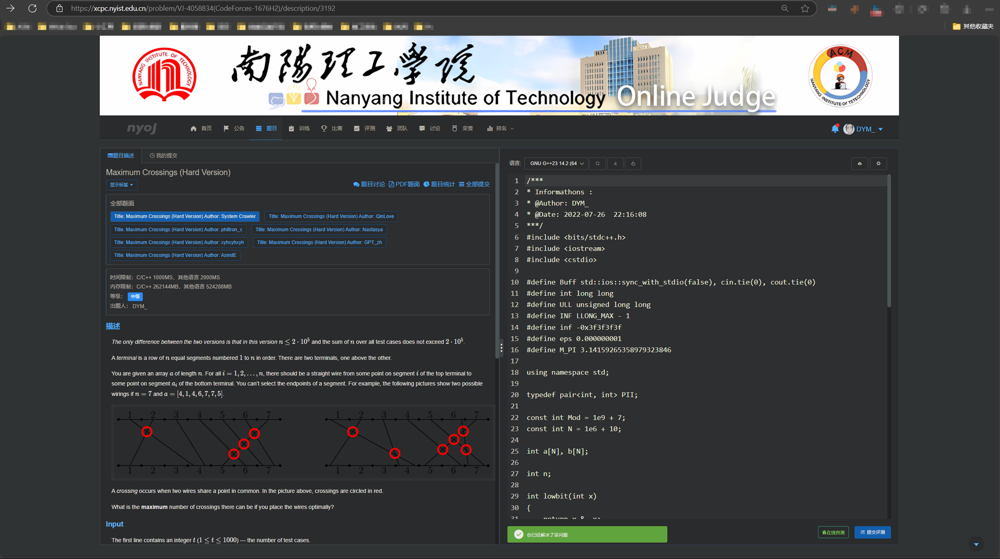

# NYIST ACM OJ (NYOJ)


[](http://openjdk.java.net/)
[](https://spring.io/projects/spring-boot)
[](https://spring.io/projects/spring-cloud-alibaba)
[](https://www.mysql.com/)
[](https://redis.io/)
[](https://github.com/alibaba/nacos)
[](https://cn.vuejs.org/)
[](https://github.com/HimitZH/HOJ)
[](https://gitee.com/himitzh0730/hoj)
[](https://qm.qq.com/cgi-bin/qm/qr?k=WWGBZ5gfDiBZOcpNvM8xnZTfUq7BT4Rs&jump_from=webapi)

## 一、总概

- 基于 Vue 和 Spring Boot、Spring Cloud Alibaba 构建的前后端分离，分布式架构的评测系统
- **支持多种评测语言：C、C++、C#、Python、PyPy、Go、Java、JavaScript、PHP、Ruby、Rust**
- **支持 HDU、POJ、Codeforces（包括 GYM）、AtCoder、SPOJ、LIBRE、SCPC 的 Remote Judge 评测**
- **支持移动端、PC 端浏览，拥有讨论区与站内消息系统**
- **支持私有训练、公开训练（题单）和团队功能**
- **完善的评测功能：普通测评、特殊测评、交互测评、在线自测、子任务分组评测、文件 IO**
- **完善的比赛功能：打星队伍、关注队伍、外榜、滚榜**
- **完善的比赛体验（赛前报名信息，赛后查重和结算）**

## 二、上线&更新日记

| 时间       | 内容                                                                 | 更新者         |
| ---------- | -------------------------------------------------------------------- | -------------- |
|            | 上线日记                                                             |                |
| 2020-10-26 | 正式开发                                                             | Himit_ZH       |
| 2021-04-10 | 首次上线测试                                                         | Himit_ZH       |
| 2021-04-15 | 判题调度 2.0 解决并发问题                                            | Himit_ZH       |
| 2021-04-16 | 重构解耦 JudgeServer 判题逻辑，添加部署文档                          | Himit_ZH       |
| 2021-04-19 | 加入 rsync 实现评测数据同步，修复一些已知的 BUG                      | Himit_ZH       |
| 2021-04-24 | 加入题目模板，修改页面页脚                                           | Himit_ZH       |
| 2021-05-02 | 修复比赛后管理员重判题目导致排行榜失效的问题                         | Himit_ZH       |
| 2021-05-09 | 添加公共讨论区，题目讨论区，比赛评论                                 | Himit_ZH       |
| 2021-05-12 | 添加评论及回复删除，讨论举报，调整显示时间。                         | Himit_ZH       |
| 2021-05-16 | 完善权限控制，讨论管理员管理，讨论删除与编辑更新。                   | Himit_ZH       |
| 2021-05-22 | 更新 docker-compose 一键部署，修正部分 bug                           | Himit_ZH       |
| 2021-05-24 | 判题调度乐观锁改为悲观锁                                             | Himit_ZH       |
| 2021-05-28 | 增加导入导出题目，增加用户页面的最近登录，开发正式结束，进入维护摸鱼 | Himit_ZH       |
| 2021-06-02 | 大更新，完善补充前端页面，修正判题等待超时时间，修补一系列 bug       | Himit_ZH       |
| 2021-06-07 | 修正特殊判题，增加前台 i18n                                          | Himit_ZH       |
| 2021-06-08 | 添加后台 i18n,路由懒加载                                             | Himit_ZH       |
| 2021-06-12 | 完善比赛赛制，具体请看在线文档                                       | Himit_ZH       |
| 2021-06-14 | 完善后台管理员权限控制，恢复 CF 的 vjudge 判题                       | Himit_ZH       |
| 2021-06-25 | 丰富前端操作，增加 POJ 的 vjudge 判题                                | Himit_ZH       |
| 2021-08-14 | 增加 spj 对使用 testlib 的支持                                       | Himit_ZH       |
| 2021-09-21 | 增加比赛打印功能、账号限制功能                                       | Himit_ZH       |
| 2021-10-05 | 增加站内消息系统——评论、回复、点赞、系统通知的消息，优化前端。       | Himit_ZH       |
| 2021-10-06 | 美化比赛排行榜，增加对 FPS 题目导入的支持                            | Himit_ZH       |
| 2021-12-09 | 美化比赛排行榜，增加外榜、打星队伍、关注队伍的支持                   | Himit_ZH       |
| 2022-01-01 | 增加公开训练和公开训练（题单）                                       | Himit_ZH       |
| 2022-01-04 | 增加交互判题、重构 judgeserver 的三种判题模式（普通、特殊、交互）    | Himit_ZH       |
| 2022-01-29 | 重构 remote judge，增加 AtCoder、SPOJ 的支持                         | Himit_ZH       |
| 2022-02-19 | 修改首页前端布局和题目列表页                                         | Himit_ZH       |
| 2022-02-25 | 支持 PyPy2、PyPy3、JavaScript V8、JavaScript Node、PHP               | Himit_ZH       |
| 2022-03-12 | 后端接口全部重构，赛外榜单增加缓存                                   | Himit_ZH       |
| 2022-03-28 | 合并冷蕴提交的团队功能                                               | Himit_ZH、冷蕴 |
| 2022-04-01 | 正式上线团队功能                                                     | Himit_ZH、冷蕴 |
| 2022-05-29 | 增加在线调试、个人主页提交热力图                                     | Himit_ZH       |
| 2022-08-06 | 增加题目标签的分类管理（二级标签）                                   | Himit_ZH       |
| 2022-08-21 | 增加人工评测、取消评测                                               | Himit_ZH       |
| 2022-08-30 | 增加 OI 题目的 subtask、ACM 题目的'遇错止评'模式                     | Himit_ZH       |
| 2022-10-04 | 增加比赛奖项配置，增加 ACM 赛制的滚榜                                | Himit_ZH       |
| 2022-11-14 | 增加题目详情页专注模式，优化首页布局                                 | Himit_ZH       |
| 2023-05-01 | 增加题目评测支持文件 IO                                              | Himit_ZH       |
| 2023-06-11 | 增加允许比赛结束后提交                                               | Himit_ZH       |
| 2023-06-27 | 支持 Ruby、Rust                                                      | Himit_ZH       |
| 2024-03-13 | 支持 LibreOJ 的远程评测                                              | Himit_ZH、Nine |
|            | 更新日记                                                             |                |
| 2023-08-20 | 增加新生排行榜                                                       | IDYMI          |
| 2023-08-21 | 增加用户偏好设置                                                     | IDYMI          |
| 2023-09-09 | 更新 NYOJ UI                                                         | IDYMI          |
| 2023-10-06 | 增加点击榜单跳转                                                     | IDYMI          |
| 2023-10-06 | 增加首页轮播图跳转                                                   | IDYMI          |
| 2023-10-18 | 增加同步赛                                                           | IDYMI          |
| 2023-10-24 | 增加 SCPC 远程评测                                                   | IDYMI          |
| 2023-11-06 | 增加系列比赛排行榜                                                   | IDYMI          |
| 2023-11-26 | 增加正式赛                                                           | IDYMI          |
| 2023-11-27 | 增加暗色模式                                                         | IDYMI          |
| 2023-12-29 | 增加 Moss 查重                                                       | IDYMI          |
| 2024-01-02 | 增加赛供文件                                                         | IDYMI          |
| 2024-02-20 | 错误测试点查看                                                       | IDYMI          |
| 2024-03-12 | 多平台 OJ 排行榜                                                     | IDYMI          |
| 2024-03-24 | 添加 QOJ 远程评测                                                    | IDYMI          |
| 2024-03-29 | 添加 NSWOJ 远程评测                                                  | IDYMI          |
| 2024-04-07 | 添加 NEWOJ 远程评测                                                  | IDYMI          |

## 三、新功能部分截图

# NYOJ 新 UI 更新

## 更新内容

1.  全部界面宽度进行跳转，并添加 南阳理工 ACM 专属 LOGO

    

2.  轮播图点击跳转对应链接，并显示文字信息

    

3.  添加用户首页的比赛排行榜变化

    显示有排名的比赛排行榜变化图

    

4.  添加题目时间轴对应时间段榜单跳转

    点击或者拖拽时间轴跳转到对应时间段榜单

    

5.  添加个人偏好设置

    可修改界面语言，默认公共题库代码语言，默认提交代码语言，默认编译器字体大小，默认代码模板

    

6.  规范题目 ID

    现将 NYOJ 对应题目 ID 全部改为数字展示 ID

2023 年 10 月 06 日 10 点

# 添加 SCPC 远程评测

## 更新内容

1.  SCPC 远程评测

    SCPC 是西南科技大学 计科 ACM 工作室，机缘巧合下决定共同训练，打造校方 ACM 品牌效应。

    下方为 SCPC 的远程评测题目，有需要欢迎到其 OJ 上做题

    

    

2023 年 10 月 28 日 12 点

# 添加系列比赛总榜单

## 更新内容

1.  添加系列比赛总榜单

    端口为 `acm-rank-static/`, 后加比赛的 cids，用 `+` 号隔开

    eg: https://nyoj.online/acm-rank-static/1208+1211+1210 对应为 23 年新生赛前三场比赛

    注：

    1\. 该功能只能登录后使用

    2\. 查询比赛任意一场比赛没有注册将无法查询

    

2023 年 11 月 06 日 3 点

# 添加正式赛

## 更新内容

1.  添加正式赛

    用户需要报名填写竞赛信息参赛，用户可邀请其他用户组成自己的队伍

    注：

    1\. 请用户前往我的设置中的竞赛设置中添加竞赛信息

    

    2\. 进入正式比赛，发送审核信息

    

    3\. 等待审核通过进入比赛

    

    4\. 多人比赛可邀请队友，队友同意后参加比赛的账号都可进入比赛（人员变化会重新审核！）

    

    5\. 队友同意，ACM 启动！

    

2023 年 11 月 26 日 2 点

# 添加暗色模式

## 更新内容

1.  添加暗色模式

    程序员护眼

    

    同时偏好设置中可设置

    

2023 年 11 月 27 日 19 点

# 添加赛供文件

## 更新内容

1.  添加赛供文件

    

2024 年 1 月 2 日 19 点

# 调整公告模块

## 更新内容

1. 调整公告模块
   1. 首页添加滚动公告
      
   2. 比赛添加滚动公告
      
   3. 比赛专注模式中同理
      

2024 年 1 月 10 日 15 点

# 调整部分主页

## 更新内容

1. 调整用户主页
   1. 用户主页添加正在攻克的题目
      
   2. 将新生排行榜改为动态选择按钮
      

2024 年 1 月 24 日 10 点

# 开放错误做题测试点查询

## 更新内容

1. 开放错误做题测试点查询
   

2024 年 2 月 20 日 12 点

# 增加友链

## 更新内容

1. 增加友链
   点击跳转到相关网页
   

2024 年 3 月 8 日 11 点

# 增加多平台 OJ 排行榜

## 更新内容

1. 增加多平台 OJ 排行榜
   填写信息，前往 https://nyoj.online/setting?active=MultiOj
   
   展示排行榜
   

2024 年 3 月 12 日 11 点

# 增加 QOJ 远程评测

## 更新内容

1. 增加 QOJ 远程评测
   

2024 年 3 月 24 日 20 点

# 增加 NSWOJ 远程评测

## 新手入坑，菜就多练！！！！

1. 增加 NSWOJ 远程评测
   
   

2024 年 3 月 29 日 15 点

# 增加 NEWOJ 远程评测

1. 增加 NEWOJ 远程评测
   
   

2024 年 4 月 7 日 19 点

# 增加 (组队)比赛账号

1. 比赛账号: 监测用户的 IP 变化，并且只允许同一 IP 登录（会顶号）
2. 组队比赛账号: 监测用户的 IP 变化

2024 年 4 月 15 日 16 点

# 增加 赛后代码展示板

1. 增加 赛后代码展示板
   

2024 年 4 月 15 日 16 点

# 增加 考场分配查询系统

1. 查看比赛对应分配的考场 https://nyoj.online/SearchExamination/cid
   
2. 查看自己的座位
   

2024 年 4 月 17 日 19 点

# 增加 选择填空判断题
   

2024 年 5 月 19 日 19 点

# 增加 PDF 题面
   

   容器配置
   app.py
   ```python
# -*- coding: utf-8 -*-

from flask import Flask, request
import subprocess
from jinja2 import Environment, FileSystemLoader
import html
from bs4 import BeautifulSoup, NavigableString, Tag
import re
import json


app = Flask(__name__)

# 路由：接收带有 KaTeX 字符串的 POST 请求并转换为 HTML
@app.route("/html", methods=["POST"])
def generate_html():
    """
    接收 POST 请求中的数据，处理 LaTeX 和 Markdown 内容，并生成 HTML 文件。

    请求参数:
    - input_path (str): 生成的 HTML 文件路径。
    - timeLimit (str): 时间限制。
    - memoryLimit (str): 空间限制。
    - title (str): 标题。
    - description (str): 问题描述。
    - input (str): 输入格式。
    - output (str): 输出格式。
    - hint (str): 补充说明。
    - examples (str): 样例。
    - selections (str): 选项。
    - EC (str): 标题是否使用字段名称，值为 "true" 或 "false"。

    返回:
    - str: 成功或失败的消息。
    """
    try:
        # 获取 POST 请求中的参数
        keys = [
            "input_path",
            "timeLimit",
            "memoryLimit",
            "title",
            "description",
            "input",
            "output",
            "hint",
            "examples",
            "selections",
            "EC",
        ]
        params = {key: request.form.get(key, None) for key in keys}
        params["EC"] = params["EC"].lower() == "true" if params["EC"] else False

        context = {"title": params["title"]}

        # 字段和标题的映射
        fields = {
            "timeLimit": "时间限制",
            "memoryLimit": "空间限制",
            "description": "问题描述",
            "input": "输入格式",
            "output": "输出格式",
            "hint": "补充",
            "examples": "样例",
            "selections": "选项",
        }

        # 加载 Jinja2 模板
        template = Environment(loader=FileSystemLoader(".")).get_template(
            "template.html"
        )

        # 处理每个字段
        for field, ch_title in fields.items():
            param = params[field]
            if param:
                context[f"{field}_title"] = (
                    ch_title if params["EC"] else field.capitalize()
                )
                if field in ["examples", "selections"]:
                    param = json.loads(param)
                    param = convert_examples(param, params["EC"], field == "examples")
                elif field not in ["timeLimit", "memoryLimit"]:
                    param = convert_latex(param)
                context[field] = param

        # 渲染并写入最终 HTML 文件
        write_(params["input_path"], template.render(**context), True)
        return "HTML generated successfully at {}".format(params['input_path']), 200

    except Exception as e:
        return "Failed to run problem: {}, Error: {}".format(params["title"], str(e)), 500


# 路由：将 HTML 转换为 PDF
@app.route("/pdf", methods=["POST"])
def generate_pdf():
    """
    使用 Pandoc 命令将输入文件转换为 PDF 并应用自定义模板和 Lua 过滤器。
    参数通过 HTTP POST 请求传入，包括输入文件路径、输出文件路径、比赛标题和比赛数据。
    """
    # 从表单获取输入参数
    input_path = request.form.get("input_path")
    output_path = request.form.get("output_path")
    EC = request.form.get("EC", "false").lower() == "true"

    # 构建 Pandoc 命令
    command = [
        "pandoc",
        input_path,
        "-t",
        "pdf",
        "-o",
        output_path,
        "--pdf-engine=xelatex",
        "--lua-filter=/app/filter.lua",
        "--template=/app/template.tex",
    ]

    # 添加 EC 参数
    command += ["-M", "ec={}".format(str(EC).lower())]

    if input_path:
        try:
            result = subprocess.run(command, stderr=subprocess.PIPE, text=True)

            command = " ".join(command)

            # 检查命令执行结果
            if result.returncode != 0:
                return (
                    "Failed to execute command: {} , Error: {}".format(
                        command, result.stderr
                    ),
                    500,
                )

            return "PDF generated successfully at {}".format(output_path), 200

        except Exception as e:
            return "Failed to run command: {} , Error: {}".format(command, str(e)), 500


# 将传入的数据列表转化为字符串，生成 HTML 表格
def convert_examples(data, EC, is_table=True):
    """
    将传入的测试数据列表转换为 HTML 字符串格式，支持生成表格或简单的无表格展示。

    参数:
    data (list): 包含测试样例的列表，列表元素为字典，包含 "input" 和 "output" 字段。
    is_table (bool): 表示是否生成表格形式的输出 (默认值为 True)。

    返回:
    str: 转换后的 HTML 字符串，如果 data 为空则返回 None。
    """

    # 如果 data 不为空，则继续处理
    if data:
        html_builder = []  # 用于拼接 HTML 片段的列表

        # 添加表格的起始部分
        html_builder.append(
            '<table class="table table-bordered table-text-center table-vertical-middle">\n'
        )

        # 如果需要生成表格形式，添加表头 (thead)
        if is_table:
            header = "输入" if EC else "Input"
            output = "输出" if EC else "Output"
            html_builder.append("<thead>\n<tr>\n<th>{}</th>\n<th>{}</th>\n</tr>\n</thead>\n".format(header, output))

        # 添加表格的主体部分 (tbody)
        html_builder.append("<tbody>\n")

        # 遍历传入的数据列表，生成每一行的内容
        for index, entry in enumerate(data):
            input_text = entry.get("input", "") # 获取 input 字段
            output_text = entry.get("output", "") # 获取 output 字段

            if is_table:
                # 生成表格形式的行
                html_builder.append("<tr><td><pre>{}</pre></td>".format(input_text))
                html_builder.append("<td><pre>{}</pre></td></tr>".format(output_text))
            else:
                # 无表格形式，添加索引标识
                html_builder.append(
                    "<tr><td>{}&nbsp;&nbsp;:&nbsp;&nbsp;{}</td></tr>".format(
                        chr(ord("A") + index), output_text
                    )
                )

        # 关闭表格主体和表格结束标记
        html_builder.append("</tbody></table>")

        # 返回生成的 HTML 字符串
        return "".join(html_builder)

    return None


# 将 Markdown 中的 LaTeX 公式转换为 HTML
def convert_latex(markdown):
    """
    将 Markdown 中的 LaTeX 公式转换为 HTML 格式，并处理 HTML 标签中的文本。

    参数:
    - markdown (str): 包含 LaTeX 公式的 Markdown 文本。

    返回:
    - content (str): 转换后的 HTML 内容。
    """

    # 使用正则表达式将所有包含多个 $ 的公式替换为单个 $
    markdown = re.sub(r"\${2,}([^$]+?)\${2,}", r"$\1$", markdown)

    # 清理 HTML 内容：替换中划线标记为 <span> 标签
    markdown = re.sub(r"<s\s*>", '<span style="text-decoration: line-through">', markdown)
    markdown = re.sub(r"</s>", "</span>", markdown)

    # 使用 BeautifulSoup 解析 HTML 文本
    soup = BeautifulSoup(markdown, "html.parser")

    # 遍历所有节点
    def process_node(node):
        to_replace = []  # 缓存待替换的节点及其新节点

        # 内部递归函数
        def traverse_node(node):
            # 如果是纯文本节点，并且不在 <span class="katex"> 标签内
            if isinstance(node, NavigableString) and not node.find_parent("span", class_="katex"):
                node_string = node.string.replace("\n", "<br>")
                # 将非 <span class="katex"> 的文本节点通过 convert_pandoc 转换
                converted_html = convert_pandoc(node_string, "markdown", "html")
                # 使用 BeautifulSoup 解析生成的 HTML 片段
                new_node = BeautifulSoup(converted_html, "html.parser")
                # 缓存待替换的节点
                to_replace.append((node, new_node))
            # 如果是标签节点，递归处理其子节点
            elif isinstance(node, Tag):
                # 跳过处理 <span class="katex"> 内的内容
                if node.get("class") and "katex" in node["class"]:
                    return
                # 递归处理其他子节点
                for child in node.children:
                    traverse_node(child)

        # 递归处理所有节点
        traverse_node(node)

        # 遍历完成后统一替换
        for old_node, new_node in to_replace:
            old_node.replace_with(new_node)

    # 开始处理节点
    process_node(soup)

    # 移除所有 class="katex-html" 的 <span> 标签及其内容
    for span in soup.find_all("span", class_="katex-html"):
        span.decompose()  # 完全移除该节点及其子节点

    # 移除所有 <annotation> 标签及其内容
    for annotation in soup.find_all("annotation"):
        annotation.decompose()  # 完全移除该节点及其子节点

    # 处理图片标签：在图片前后添加段落，去除 alt 属性
    for img in soup.find_all("img"):
        img.wrap(soup.new_tag("p"))  # 在图片周围添加段落
        img.attrs.pop("alt", None)   # 去除 alt 属性

    # 去除 <figcaption> 标签及内容
    for figcaption in soup.find_all("figcaption"):
        figcaption.decompose()

    # 去除 <figure> 标签，但保留其内部内容
    for figure in soup.find_all("figure"):
        figure.unwrap()

    return str(soup)


# 字符串传入转化为对应格式字符串
def convert_pandoc(input_text, from_format="markdown", to_format="html"):
    """
    使用 Pandoc 将输入字符串从一种格式转换为另一种格式。

    支持的格式包括：
            - markdown: Markdown 格式
            - html: HTML
            - latex: LaTeX
            - docx: Microsoft Word 文档
            - odt: OpenDocument 文本
            - rst: reStructuredText
            - mediawiki: MediaWiki 标记
            - asciidoc: AsciiDoc
            - epub: EPUB 电子书
            - json: Pandoc JSON
            - org: Emacs Org-mode 文档
            - textile: Textile 格式
            - pptx: Microsoft PowerPoint
            - pdf: PDF 文件 (输出支持，输入不直接支持)

    参数:
        input_text (str): 要转换的输入字符串内容。
        from_format (str): 输入格式（默认为 'markdown'），可为 pandoc 支持的格式之一。
        to_format (str): 输出格式（默认为 'html'），可为 pandoc 支持的格式之一。

    返回:
        str: 转换后的字符串内容，若转换成功则返回转换后的结果。
        如果发生错误则返回相应的错误信息。

    异常:
        如果 pandoc 出现错误，会捕获异常并返回错误描述。
    """
    try:
        # 使用 subprocess 运行 pandoc 命令并传入输入字符串
        result = subprocess.run(
            ["pandoc", "--from", from_format, "--to", to_format, "--mathml"],
            input=input_text.encode("utf-8"),  # 将输入字符串编码为字节传给 Pandoc
            stdout=subprocess.PIPE,  # 捕获 Pandoc 的标准输出
            stderr=subprocess.PIPE,  # 捕获 Pandoc 的错误信息
        )

        # 检查 Pandoc 命令的执行结果
        if result.returncode == 0:
            # 如果成功执行，返回 Pandoc 输出的字符串
            str_ = result.stdout.decode("utf-8") # 将字节解码为字符串
            return re.sub(r'^<p>(.*?)</p>$', r'\1', str_, flags=re.DOTALL) # 匹配最外层的 <p> 标签并将其去除
        else:
            # 如果 Pandoc 返回了非零状态码，说明发生了错误，返回错误信息
            raise Exception("Pandoc Error: {}".format(result.stderr.decode('utf-8')))

    except Exception as e:
        # 捕获异常并返回错误信息
        return "Pandoc Error: {}".format(str(e))


def write_(file_name, content, is_beauty=False):
    """
    将内容写入文件，并可选地美化 HTML 内容。

    参数:
    - file_name (str): 要写入的文件名。
    - content (str): 要写入的内容，通常是 HTML 文本。
    - is_beauty (bool): 是否美化 HTML 内容，默认为 False。
    """
    with open(file_name, "w", encoding="utf-8") as f:
        if is_beauty:
            # 解析 HTML 内容
            soup = BeautifulSoup(content, "html.parser")

            # 对文本节点进行 HTML 转义，但不转义标签
            for element in soup.descendants:
                if isinstance(element, str) and element.parent.name not in ["script", "style"]:
                    # 仅对标签内的文本进行转义，而非标签本身
                    element.replace_with(html.escape(element))

            # 替换 table 中的空格为 &nbsp;
            for td in soup.find_all("td"):
                # 遍历所有子节点
                for child in td.children:
                    if isinstance(child, NavigableString):
                        # 仅替换普通文本中的空格为 &nbsp;
                        new_text = str(child).strip().replace(" ", "nbsp_nbsp")
                        child.replace_with(new_text)

            # 美化 HTML 输出
            content = soup.prettify().replace("nbsp_nbsp", "&nbsp;")

        f.write(content)


# 读取文件内容
def read_(file_name):
    """
    读取指定文件的内容。

    参数:
    - file_name (str): 要读取的文件名。

    返回:
    - str: 文件内容。
    """
    with open(file_name, "r", encoding="utf-8") as f:
        return f.read()


if __name__ == "__main__":
    app.run(host="0.0.0.0", port=80)


   ```
   filter.lua
··```
-- 递归将表格转换为字符串并处理 HTML 标签
function tableToString(tbl)
  local result = {}

  -- 遍历表格的每一个键值对
  for k, v in pairs(tbl) do
      local valueString

      if type(v) == "table" then
          -- 如果值是表格，递归调用自己
          valueString = tableToString(v)
      elseif type(v) == "string" then
          -- 否则直接转换为字符串，并处理 HTML 标签
          valueString = tostring(v)
          valueString = valueString:gsub("&nbsp;", " ")
      end

      -- 仅当 valueString 非空时才插入
      if valueString and valueString ~= "" then
          table.insert(result, valueString)
      end
  end

  -- 将表格内容拼接为字符串并返回
  return table.concat(result, "\n")
end

function Table(el)
  -- 检查表格是否包含有效数据
  if not el or (not el.headers or #el.headers == 0) and (not el.rows or #el.rows == 0) then
    return nil -- 如果表格没有内容，返回空
  end

  local tbl = {}

  -- 调整表格行高
  table.insert(tbl, "\\renewcommand{\\arraystretch}{1.5}")
  -- 定义表格，使用 tabularx 使表格宽度自适应
  table.insert(tbl, "\\begin{longtable}{ l l }")

  -- 使用 \toprule 定义表格的顶线
  table.insert(tbl, "\\toprule")

  -- 判断 <tbody> 中的第一行的 <td> 数量是否大于 1
  local firstRow = el.rows[1]
  if firstRow and #firstRow > 1 then
    -- 处理表格头部，增加加粗效果
    if el.headers and #el.headers > 0 then
      local headerRow = {}
      for _, cell in ipairs(el.headers) do
        -- 确保每个表头单元格存在
        local cellContent = pandoc.utils.stringify(cell) or ""
        -- 将单元格内容转为字符串并加粗
        table.insert(headerRow, "\\textbf{" .. cellContent .. "}")
      end

      -- 表头下方使用 \midrule
      table.insert(tbl, table.concat(headerRow, " & ") .. " \\\\ \\toprule")
    end
  end

  -- 处理表格的内容
  for i, row in ipairs(el.rows) do
    local rowContent = {}
    for _, cell in ipairs(row) do
      -- 假设表格内有你想提取的实际内容
      cellContent = tableToString(cell)

      -- 使用 minipage 和 verbatim 来包裹单元格内容
      table.insert(rowContent, "\\begin{minipage}[t]{0.47\\columnwidth}\\raggedright\n\\begin{verbatim}\n" .. cellContent .. "\n\\end{verbatim}\n\\strut\n\\end{minipage}")
    end
    -- 插入一行内容
    table.insert(tbl, table.concat(rowContent, " & ") .. " \\\\")

    -- 如果不是最后一行，插入细线
    if i < #el.rows then
      table.insert(tbl, "\n\\midrule")
    end
  end

  -- 使用 \bottomrule 定义表格底部的线
  table.insert(tbl, "\\bottomrule")

  -- 结束表格
  table.insert(tbl, "\\end{longtable}")

  -- 返回完整的 LaTeX 表格
  return pandoc.RawBlock("latex", table.concat(tbl, "\n"))
end

   ```
   Dockerfile
   ```cmd
# 使用基础镜像
FROM ubuntu:22.04

ARG DEBIAN_FRONTEND=noninteractive

ENV TZ=Asia/Shanghai

# 更新软件包列表并安装 Python、pandoc、LaTeX 和字体依赖
RUN apt-get update && \
    apt-get install -y \
    python3.10 \
    python3-pip \
    pandoc \
    texlive-full \
    vim \
    fonts-wqy-microhei \
    ttf-mscorefonts-installer \
    wget \
    unzip \
    cabextract && \
    apt-get autoremove -y && \
    apt-get autoclean

# 从 GitHub 下载 Microsoft 核心字体
RUN wget https://downloads.sourceforge.net/corefonts/courie32.exe -O /tmp/courie32.exe && \
    cabextract /tmp/courie32.exe -d /usr/share/fonts/truetype/msttcorefonts/ && \
    rm /tmp/courie32.exe

# 从 GitHub 下载 Libertinus 字体
RUN wget https://github.com/alerque/libertinus/releases/download/v7.040/Libertinus-7.040.zip && \
    unzip Libertinus-7.040.zip && \
    cp Libertinus-7.040/static/OTF/*.otf /usr/share/fonts/opentype/ && \
    rm -rf Libertinus-7.040 && \
    rm Libertinus-7.040.zip && \
    fc-cache -fv

# 从 GitHub 下载 Noto 字体
RUN wget https://noto-website-2.storage.googleapis.com/pkgs/Noto-unhinted.zip && \
    unzip Noto-unhinted.zip -d noto-fonts && \
    cp noto-fonts/*.otf /usr/share/fonts/opentype/ && \
    cp noto-fonts/*.ttf /usr/share/fonts/truetype/ && \
    rm -rf noto-fonts && \
    rm Noto-unhinted.zip && \
    fc-cache -fv

# 设置工作目录
WORKDIR /app

# 更新 pip 到最新版本
RUN python3 -m pip install --upgrade pip

# 复制 Python 文件
COPY requirements.txt requirements.txt

# 安装 Python 依赖
RUN pip3 install -r requirements.txt

# 复制模板文件到工作目录
COPY app.py /app/
COPY template.html /app/
COPY template.tex /app/
COPY filter.lua /app/

# 启动 Flask 服务
CMD ["python3", "app.py"]

   ```
   requirements.txt
   ```txt
Flask==2.0.2
werkzeug==2.0.2
Jinja2==3.0.3
beautifulsoup4==4.12.2

   ```
   创建容器
   ```docker
docker build -t hoj-htmltopdf .
   ```
   template.html
   ```html
<html lang="en">
  <head>
    <meta http-equiv="content-type" content="text/html;charset=utf-8" />
    <title>{{ title }}</title>
    <style>
      body {
        font-family: Arial, sans-serif;
        line-height: 1.6;
      }
      .header {
        text-align: center;
        font-size: 14px;
        margin-bottom: 20px;
      }
      .title {
        text-align: left;
        font-size: 18px;
        margin-bottom: 10px;
      }
      .info {
        margin-left: 15px;
        margin-bottom: 20px;
      }
      .info span {
        display: block;
      }
      .content {
        margin-bottom: 20px;
      }
      .keyboard {
        text-align: center;
      }
      .keyboard img {
        width: 100%;
        max-width: 600px;
      }
      .note {
        margin-top: 10px;
      }
      table {
        margin: 10px auto;
        width: 100%;
        border-collapse: collapse;
      }
      th,
      td {
        border: 1px solid black;
        padding: 8px;
        width: 50%;
      }
      .strong {
        font-weight: bolder;
      }
      .hljs-center {
        text-align: center;
      }
      .hljs-right {
        text-align: right;
      }
      .hljs-left {
        text-align: left;
      }
    </style>
  </head>
  <body>
    <div class="title"><h1>{{ title }}</h1></div>
    <div class="info">
      <p><strong>{{ timeLimit_title }}: </strong> {{ timeLimit }} millisecond</p>
      <p><strong>{{ memoryLimit_title }}: </strong> {{ memoryLimit }} megabytes</p>
    </div>
    
    <div class="content">
      <h2>{{ description_title }}</h2>
      {{ description }}
    </div>
     
    <div class="content">
      <h2>{{ input_title }}</h2>
      {{ input }}
    </div>
     
    <div class="content">
      <h2>{{ output_title }}</h2>
      {{ output }}
    </div>
     
    <div class="content">
      <h2>{{ hint_title }}</h2>
      {{ hint }}
    </div>
     
    <h2>{{ examples_title }}</h2>
    {{ examples }}  
    <h2>{{ selections_title }}</h2>
    {{ selections }} 
  </body>
</html>

   ```
   template.tex
   ```
\documentclass[a4paper,12pt]{article}

% 设置页边距
\usepackage{geometry}
\geometry{a4paper, margin=0.5in}

% 加载必要的包
\usepackage{fancyhdr}   % 控制页眉页脚
\usepackage{lastpage}   % 获取总页数
\usepackage[colorlinks=false, pdfborder={0 0 0}]{hyperref}   % 支持超链接
\usepackage{fontspec}   % 支持系统字体
\usepackage{xeCJK}      % 支持中文
\usepackage{unicode-math}  % 数学符号支持
\usepackage{titlesec}   % 修改标题样式
\usepackage{enumitem}   % 自定义列表样式
\usepackage{parskip}    % 控制段落间距
\usepackage{multirow}   % 多行单元格合并
\usepackage{graphicx}   % 插入图片
\usepackage{caption}    % 图片标题控制
\usepackage{longtable}  % 支持长表格
\usepackage{booktabs}   % 支持表格命令
\usepackage{tabularx}   % 自动调整列宽的表格
\usepackage{array}      % 处理表格中的边框
\usepackage{lipsum}     % 生成占位符文本（测试用）

% 设置字体
\setmathfont{Libertinus Math}  % 数学字体
\setmonofont{Courier New} % 英文等宽字体
\setCJKmainfont{Noto Sans CJK SC}  % 中文字体
\setCJKmonofont{Noto Sans Mono CJK SC}  % 中文等宽字体
\setmainfont{Libertinus Serif}  % 主字体

% 设置标题样式
\titleformat{\section}[block]{\normalfont\Large\bfseries}{}{0em}{}
\titleformat{\subsection}[block]{\normalfont\large\bfseries}{}{0em}{}
\titleformat{\subsubsection}[block]{\normalfont\normalsize\bfseries}{}{0em}{}

% 设置页眉页脚样式
\pagestyle{fancy}
\fancyhf{}

% 调整页眉和页脚高度
\setlength{\headheight}{40pt}  % 页眉高度
\setlength{\headsep}{10pt}     % 页眉与正文之间的距离
\setlength{\footskip}{5pt}    % 页脚与正文之间的距离

% 判断是否使用中文页脚
$if(ec)$
    $if(ec)$
        \fancyfoot[C]{第 \thepage\ 页，共 \pageref{LastPage} 页}  % 中文页脚
    $else$
        \fancyfoot[C]{Page \thepage\ of \pageref{LastPage}}  % 英文页脚
    $endif$
$else$
    % 没有页脚内容
    \fancyfoot{}
$endif$

\renewcommand{\headrulewidth}{0.8pt}  % 页眉横线的粗细
\renewcommand{\footrulewidth}{0.8pt}  % 页脚横线的粗细

% 定义 \tightlist 避免报错
\providecommand{\tightlist}{%
  \setlength{\itemsep}{0pt}\setlength{\parskip}{0pt}}

% 定义图片自适应页面宽度
\makeatletter
\def\maxwidth{\ifdim\Gin@nat@width>\linewidth \linewidth \else \Gin@nat@width\fi}
\makeatother
\setkeys{Gin}{width=\maxwidth, keepaspectratio}  % 自动调整图片尺寸并保持比例

% 表格宽度自适应页面宽度，靠左对齐
\newcolumntype{Y}{>{\raggedright\arraybackslash}X}  % 定义靠左对齐的列类型

% 在每个 HTML 内容之间插入分页符
\newcommand{\sectionbreak}{\newpage}

% 文档内容从这里开始
\begin{document}
$body$
\end{document}
% 文档内容到这里结束

   ```
   docker-compose.yml 中添加
   ```yml
  hoj-htmltopdf:
    image: hoj-htmltopdf
    container_name: hoj-htmltopdf
    volumes:
        - ${HOJ_DATA_DIRECTORY}/file/problem:/tmp/htmltopdf
    ports:
        - "8001:80"
    restart: always
    privileged: true # 设置容器的权限为root
    networks:
      hoj-network:
        ipv4_address: 172.20.0.9

   ```

2024 年 5 月 20 日 20 点

# 增加 代码量统计

   容器配置
   app.py
   ```python
   from flask import Flask, request
   import subprocess

   app = Flask(__name__)


   @app.route("/", methods=["POST"])
   def execute_command():
      command = request.form.get("command", "")
      if command:
         command = command.encode("utf-8").decode("utf-8")
         result = subprocess.run(command, shell=True, capture_output=True, text=True)
         return result.stdout, 200
      else:
         return "No command provided", 400


   if __name__ == "__main__":
      app.run(host="0.0.0.0", port=80)
   ```
   Dockerfile
   ```cmd
   FROM python:3.9-slim

   # 安装 cloc
   RUN apt-get update && \
      DEBIAN_FRONTEND=noninteractive \
      apt-get install -y --no-install-recommends \
      perl \
      wget \
      ca-certificates && \
      wget -nv https://github.com/AlDanial/cloc/releases/download/v2.00/cloc-2.00.pl \
      -O /usr/local/bin/cloc && \
      apt-get remove -y wget ca-certificates && \
      apt-get autoremove -y && \
      apt-get autoclean && \
      rm -r /var/lib/apt/lists/* && \
      chmod +x /usr/local/bin/cloc

   WORKDIR /app

   COPY requirements.txt requirements.txt
   RUN pip install -r requirements.txt

   COPY . .

   CMD ["python", "app.py"]

   ```
   requirements.txt
   ```txt
   Flask==2.0.2
   werkzeug==2.0.2
   ```
   创建容器
   ```docker
   docker build -t hoj-cloc .
   ```
   docker-compose.yml 中添加
   ```yml
  hoj-cloc:
    image: hoj-cloc
    container_name: hoj-cloc
    volumes:
        - ${HOJ_DATA_DIRECTORY}/file/code:/tmp/code
    restart: always
    ports:
        - "8002:80"
    networks:
      hoj-network:
        ipv4_address: 172.20.0.10

   ```

2024 年 5 月 25 日 14 点

# 增加荣誉榜单
   

2024 年 7 月 12 日 16 点

# 多题面部署
   

2024 年 7 月 14 日 16 点

# 增加 Vjudge 远程评测

1. 增加 Vjudge 远程评测
   
   
2024 年 10 月 7 日 24 点
